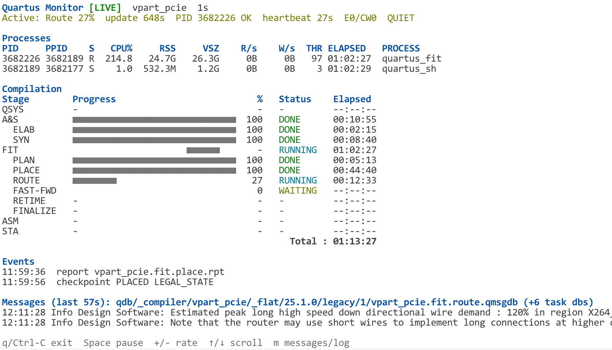

# qwatch

`qwatch` is a read-only terminal monitor for Altera Quartus Prime
(formerly Intel Quartus Prime) compilations on Linux.

It reads Quartus compiler databases and runtime metadata directly, and augments
them with Linux `/proc` metrics, without launching an additional `quartus_sh`
process or modifying the running compilation.



## Features

* Live Quartus compilation status in a single terminal screen
* Analysis & Synthesis, Fitter, Assembler, and Timing Analyzer tracking
* Quartus-native task status and elapsed time
* Native child-task percentages where Quartus provides them
* Indeterminate progress bars for parent stages whose running percentage is not meaningful
* CPU, memory, I/O, thread, process, and liveness monitoring
* Active process PID and liveness reporting
* Flow health reporting with `ACTIVE`, `QUIET`, and `STALE` states
* Error and critical-warning counts from Quartus task state
* Incremental Quartus `.qmsgdb` message display
* Checkpoint and report-file event display
* Automatic detection of new compilation generations
* QSYS activity tracking when present
* Optional build-log viewer
* Immediate redraw on terminal resize without additional sampling
* Read-only operation that does not control or interfere with Quartus
* No third-party Python dependencies

## Requirements

* Linux with `/proc`
* Python 3.10 or newer
* A Quartus project whose compiler database is under `qdb/_compiler`

No third-party Python packages are required.

## Usage

Run `qwatch` from the Quartus project root:

```console
python3 /path/to/qwatch.py
```

You can also specify another project root:

```console
python3 /path/to/qwatch.py --root /path/to/quartus/project
```

Available options:

```text
--root PATH          Quartus project root (default: current directory)
--project NAME       Override the automatically detected display name
--interval SEC       Refresh interval (default: 1)
--log PATH|auto      Enable the optional build-log view
--lines COUNT        Maximum displayed message/log lines (default: 20)
--stitch-gap SEC     Maximum gap between linked Quartus invocations (default: 60)
```

The displayed project name is inferred from the active compiler database, a
single `.qpf` in the project root, or finally the root-directory name.

## Controls

While `qwatch` is running:

| Key      | Action                                                          |
| -------- | --------------------------------------------------------------- |
| `q`      | Exit                                                            |
| `Ctrl-C` | Exit                                                            |
| `Space`  | Pause or resume data sampling                                   |
| `+`      | Shorten the sampling interval                                   |
| `-`      | Lengthen the sampling interval                                  |
| `Up`     | Scroll messages or the build log up                             |
| `Down`   | Scroll messages or the build log down                           |
| `m`      | Switch between Quartus messages and the optional build-log view |

The sampling interval is clamped between 0.2 and 10 seconds.

Terminal resizes redraw immediately from the cached snapshot and do not trigger
additional SQLite, `/proc`, or log sampling.

`qwatch` requires interactive stdin and stdout. Redirected output is rejected
instead of emitting an unbounded stream of ANSI screen updates.

## Quartus Messages

By default, the lower part of the UI displays incremental Quartus messages read
from task `.qmsgdb` files associated with the current compilation session.

`qwatch` discovers message databases both from the active compiler database
directory and from `.qmsgdb` files opened by active Quartus processes.

Message databases are opened in SQLite read-only mode.

Quartus messages are used for display only. They are not used to determine:

* task state;
* task completion;
* compilation generation boundaries;
* flow liveness.

## Optional Build-Log View

The build-log view is disabled by default.

To enable it, pass a log file explicitly:

```console
python3 /path/to/qwatch.py --log path/to/build.log --lines 20
```

You can then press `m` to switch between Quartus messages and the build log.

Passing `auto` enables a convenience fallback that selects the newest
`logs/*.latest.log` file:

```console
python3 /path/to/qwatch.py --log auto --lines 20
```

The `logs/*.latest.log` naming convention is not provided by Quartus and is only
a convenience supported by `qwatch`.

Build logs never affect:

* flow detection;
* task status;
* compilation generation detection;
* session grouping;
* completion detection.

They are used only for display.

## How It Works

`qwatch` combines Quartus compiler metadata with Linux process information.

Its primary data sources are:

* `runlog.db`

  * flow status;
  * task status;
  * native task percentages;
  * timestamps;
  * compiler process relationships;
  * checkpoint fields;
  * result fields;
  * success state;
  * error counts;
  * critical-warning counts.

* task `.qmsgdb` files

  * incremental Quartus compiler messages.

* `state.meta`

  * checkpoint validity;
  * checkpoint dependencies;
  * checkpoint completion information.

* Quartus report files

  * report creation and update events.

* Linux `/proc`

  * CPU usage;
  * resident and virtual memory;
  * read and write I/O rates;
  * thread counts;
  * process hierarchy;
  * process state;
  * process liveness;
  * process elapsed time.

* `flow.<run>.heartbeat`

  * stale-flow detection when available.

## Compiler Database Access

Compiler status discovery currently searches for:

```text
qdb/_compiler/**/legacy/*/runlog.db
```

If multiple matching databases exist, `qwatch` selects the newest one by file
modification time.

`runlog.db` is opened as SQLite using read-only mode:

```text
mode=ro
```

Task `.qmsgdb` files are also opened using SQLite read-only mode.

`qwatch` does not modify either database.

## Compilation State

Build logs are never parsed to determine compilation state.

The primary compilation state comes from Quartus task records in `runlog.db`.

### Parent Stages

The Analysis & Synthesis and Fitter parent rows use Quartus-native status and
elapsed-time information.

Quartus does not provide a meaningful continuously running percentage for these
parent rows, so while they are running `qwatch` displays:

* an indeterminate progress bar;
* no numeric percentage;
* the native Quartus task status;
* stage elapsed time.

When a parent task completes, it is displayed as 100%.

### Child Stages

Child tasks retain the percentages supplied by Quartus.

Recognized child stages currently include:

```text
Analysis & Elaboration
Synthesis
Plan
Place
Route
Fast Forward
Retime
Fitter (Finalize)
```

Assembler and Timing Analyzer are displayed as separate top-level stages.

For running child stages, elapsed time is calculated from the task-local
`start_time`. This avoids using cumulative Fitter elapsed time for child rows
where Quartus reports it that way.

## Checkpoints

`qwatch` reads Quartus `state.meta` files from the compiler database hierarchy.

Only checkpoint metadata whose validity is:

```text
LEGAL_STATE
```

is considered valid.

The checkpoint metadata is used to track:

* checkpoint stage;
* checkpoint modification time;
* predecessor stage;
* predecessor modification time.

Recognized checkpoint stages currently include:

```text
partitioned
synthesized
planned
placed
routed
fastforward
retimed
final
```

Checkpoint information can also be used to reconstruct completed child-stage
rows when Quartus has retained a valid checkpoint but the corresponding task row
is not available in the current visible task set.

## Events

`qwatch` contains a lightweight event view for filesystem-level compiler
transitions.

It watches:

* `state.meta` files under the active compiler database;
* `*.rpt` files in the project root.

When a watched file is created or updated after monitoring begins, the event is
shown in the terminal.

For `state.meta`, the event includes the checkpoint stage and validity when
available.

For report files, `qwatch` reports that the file changed. It does not parse the
report contents or use report text to determine compilation state.

## Compilation Generations

`qwatch` distinguishes successive compilations of the same project so that stale
task state from an older build is not mixed with a newly started compilation.

Generation changes can be detected through:

* replacement of `runlog.db`;
* disappearance of an old `runlog.db` after its associated running process has terminated;
* a new project-scoped Quartus front-end process starting after the previous compilation activity.

Project-scoped generation drivers currently include:

```text
qsys-generate
quartus_syn
quartus_map
quartus_sh --flow
```

`quartus_syn`, `quartus_map`, and `quartus_sh` are associated with the current
project using their working directory.

`qsys-generate` is associated with the current project using its command line
and project-root path.

Quartus processes started for IPC or Monitoring Mode are excluded from
generation detection.

Fitter, Assembler, and Timing Analyzer task records are treated as stages of the
same compilation generation rather than as new generation boundaries.

### Linked Quartus Invocations

Quartus may execute adjacent compiler invocations that belong to one logical
compilation.

For `Flow` runs, `qwatch` can stitch adjacent compatible invocations into one
displayed session.

The maximum permitted gap is controlled by:

```text
--stitch-gap SEC
```

and defaults to 60 seconds.

An earlier Analysis & Synthesis invocation is only linked when its completion
and synthesis checkpoint are consistent with the later flow.

## QSYS

QSYS activity is displayed when a project-scoped `qsys-generate` process is
detected.

`qwatch` tracks QSYS elapsed time from Linux process information.

QSYS is optional and is not required for compilation-generation detection.

A build that does not use QSYS can still be tracked normally.

## Process Monitoring

`qwatch` samples Linux `/proc` for Quartus processes associated with active
compiler task PIDs and their relevant process ancestry.

Depending on terminal width, the process table includes:

```text
PID
PPID
process state
CPU %
RSS
VSZ
read rate
write rate
thread count
elapsed time
process name
```

On narrower terminals, read and write I/O are combined into a single I/O-rate
column.

CPU and I/O rates are calculated from differences between consecutive samples.

## Flow Health

`qwatch` reports the health of the currently active compiler task.

The health line can include:

* active Quartus task;
* native task percentage;
* age of the latest Quartus task-state update;
* active task PID;
* PID liveness;
* heartbeat age;
* error count;
* critical-warning count.

The displayed flow state can be:

```text
ACTIVE
QUIET
STALE
```

A flow becomes `QUIET` when the active task has not updated for more than
approximately 120 seconds.

A flow is considered `STALE` when its recorded process is no longer alive and
the Quartus heartbeat is either unavailable or older than approximately
300 seconds.

These states are monitoring heuristics and do not replace Quartus task status.

## Project Name Detection

Unless overridden with:

```console
--project NAME
```

the initial display name is selected from:

1. a single `.qpf` file in the project root;
2. otherwise the project-root directory name.

Once an active compiler database is found, `qwatch` attempts to derive the
project name from its path under:

```text
qdb/_compiler
```

and uses that value when possible.

## Compatibility

The current release has been tested on Linux with:

**Quartus Prime Pro 25.1.0, Build 129, Patches 0.36 SC**

Other Quartus editions and releases have not yet been verified.

`qwatch` validates internal structures where practical rather than silently
assuming compatibility.

Some of those structures are Quartus implementation details rather than stable
public APIs.

### Compiler Database Layout

Compiler status discovery currently expects:

```text
qdb/_compiler/**/legacy/*/runlog.db
```

A future Quartus release may change this directory structure.

### `runlog.db` Schema

Before using the database, `qwatch` validates the `status` table schema.

Required fields currently include:

```text
id
name
run_name
percent
status
start_time
last_updated
end_time
elapsed_time
process_id
parent_id
checkpoint
result
success
errors
critical_warnings
hostname
```

If the schema is incompatible, `qwatch` reports an error such as:

```text
unsupported runlog schema; missing ...
```

An incompatible schema is not silently interpreted as a known one.

### `.qmsgdb` Schema

Task message databases are also schema-checked.

The required `messages` fields are:

```text
sequence_id
time
source
type
text
```

An incompatible message database produces an explicit error such as:

```text
unsupported qmsgdb schema; missing ...
```

### Quartus Task Names

Flow rendering currently recognizes the English Quartus Prime Pro task names:

```text
Analysis & Synthesis
Analysis & Elaboration
Synthesis
Fitter
Fitter (Partial)
Plan
Place
Route
Fast Forward
Retime
Fitter (Finalize)
Assembler
Timing Analysis (Finalize)
```

Future Quartus releases, localized installations, or other Quartus editions may
use different task names and require an additional compatibility mapping.

### Linux `/proc`

Process monitoring currently depends on Linux `/proc`, including:

```text
/proc
/proc/uptime
/proc/<pid>/stat
/proc/<pid>/status
/proc/<pid>/io
/proc/<pid>/cmdline
/proc/<pid>/cwd
/proc/<pid>/fd
```

Other operating systems are not currently supported.

Compatibility should therefore be checked explicitly when adding support for a
new Quartus release, especially across major-version changes.

## Read-Only Design

`qwatch` is designed as an observer.

It does not:

* launch an additional Quartus Monitoring Mode session;
* start another `quartus_sh` process;
* control the active compilation;
* modify Quartus databases;
* write compiler state;
* alter the Quartus project;
* derive task state from build-log text.

The purpose of `qwatch` is to observe an existing Quartus compilation without
becoming part of the compilation flow itself.

## Failure Behavior

`qwatch` prefers explicit failure or unavailable state over silently displaying
misleading compiler information.

Examples include:

* incompatible `runlog.db` schemas are rejected;
* incompatible `.qmsgdb` schemas are reported;
* non-interactive stdin or stdout is rejected;
* missing compiler state is not reconstructed from build logs;
* unknown Quartus internal structures are not assumed to match known layouts.

This is intentional because `runlog.db`, `.qmsgdb`, `state.meta`, and parts of
`qdb/_compiler` are Quartus implementation details rather than stable public
interfaces.

## Project Layout

A minimal repository layout is:

```text
qwatch/
├── qwatch.py
├── README.md
├── LICENSE
└── figures/
    └── image.png
```

## License

MIT. See [LICENSE](LICENSE).
